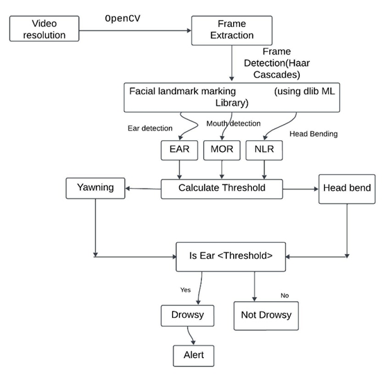

# Drowsiness Detection

Purpose of the Project 
The Drowsiness Detection System enhances road safety by monitoring drivers' facial features through a webcam and detecting signs of fatigue in real time. It uses computer vision techniques, including eye aspect ratio (EAR) and yawning detection, to identify drowsiness. Upon detecting signs of fatigue, the system triggers an alarm, alerting the driver to prevent accidents caused by drowsiness. This project is particularly beneficial for long-distance and commercial drivers, helping reduce road accidents due to fatigue.

Design diagram
The Figure1 outlines the flow of operations in a Drowsiness Detection System using computer vision and machine learning techniques The process begins by capturing live video from a camera, where the resolution of the video is a key input. OpenCV, a widely used computer vision library, is used to extract frames from the continuous video stream. Each frame is then passed through a face detection algorithm using Haar Cascades, which is effective in detecting human faces. This is a classical object detection technique based on machine learning. Once a face is detected, the system uses dlib's machine learning algorithms to mark 68 key facial landmarks on the face, including the eyes, mouth, and head position. Then EAR, MOR, NLR Calculation is done. These values (EAR, MOR, and NLR) are compared to predefined thresholds to determine whether the driver is showing signs of fatigue. Thresholds are used to decide if a particular value (e.g., eye closure or yawning) crosses a limit indicative of drowsiness. In parallel with checking thresholds, the system monitors for yawning to further reinforce the signs of drowsiness. If the Eye Aspect Ratio (EAR) falls below the threshold and yawning or head bending is detected, the system concludes the driver is drowsy and, If drowsiness is detected, the system triggers an alert, typically an audio warning, to wake the driver and prevent a possible accident.

Millstone Completed
1.	Yawn detection through Mouth Open Ratio (MOR).	Mid Term
2.	Drowsiness Alert through (EAR) Eye Aspect Ratio.	Mid Term
3.	Alert sound generation.	Mid Term
4.	Drowsiness Alert through Neck bend.	End Term
5.	Dynamically calculate threshold from the first appearance of a person's image.	End Term

We have successfully completed mid term Millsotes
Now we will work on our end term millstone 

